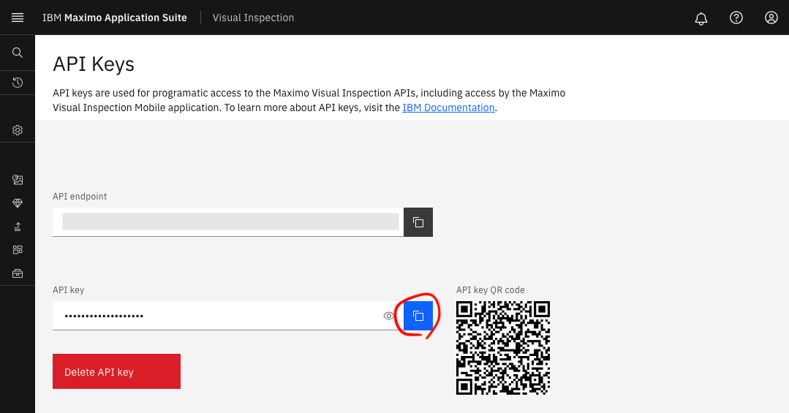
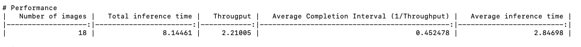

# Maximo Visual Inspection (MVI) Validator


[MVI Validator](https://github.com/IBM/mvi-validator) is an accuracy validator for Maximo Visual Inspection.


## Setup （セットアップ）


1. Pythonをインストールする。
    コマンドラインから`python3`コマンドと`pip3`コマンドを実行できるか確認する
    
    ```sh
    $ python3 --version
    Python 3.11.0
    
    $ pip3 --version 
    pip 22.3 from pip (python 3.11)
    ```
    
    
    
2. インストール
   
    ```bash
    pip install 'git+https://github.com/IBM/mvi-validator.git'
    ```
    
    
    
3. コマンドラインから`mvi-validator`コマンドを実行できるか確認する。
   
    ```sh
    $ mvi-validator --version
    0.0.13
    
    # Command not found エラーが出る場合は、`mvi-validator` を `python -m mvi-validator` にすると動くかもしれません
    $ python -m mvi-validator --version
    0.0.13
    ```


## Usage（使い方）

1. MVI > 左メニュー > データセット > テスト用に作成したデータセットを選択 > 右上の エクスポートボタンをクリック > zipファイルをローカルPCに保存
    

    

2. ダウンロードしたzipファイルを解凍する。
    - 例) カレントディレクトリの下の`test_ball_bearing`ディレクトリに解凍したとすると、以下のようになる
        ```
        $ tree . | head
        .
        └── test_ball_bearing
            ├── 00196b51-d6e7-4372-81a6-f99f15541520.jpg
            ├── 00196b51-d6e7-4372-81a6-f99f15541520.xml
            ├── 002dc8fb-1806-4f73-9df8-4e93210e08f7.jpg
            ├── 002dc8fb-1806-4f73-9df8-4e93210e08f7.xml
            ├── 004b9976-3b36-4002-861b-d692c7db43dd.jpg
            ├── 004b9976-3b36-4002-861b-d692c7db43dd.xml
            ├── 005d5394-64ea-4d1f-a353-fac0fb5ebcb4.jpg
            ├── 005d5394-64ea-4d1f-a353-fac0fb5ebcb4.xml
        
        ```

    

3. MVI  > 左メニュー > モデル >  検証したいモデル > デプロイ

4. MVI > 左メニュー > `MVI Services` > `API Keys`, コピーボタン
    

    

5. 環境変数`APIKEY` に入れておく

    ```sh
    export APIKEY=<API Key>
    ```

    

6. MVI > 左メニュー > デプロイ済みモデル > デプロイ済みモデルのAPIエンドポイントの`コピー`をクリック

    - 例) 以下のページでコピーしてきたURLは `https://mvi.com/api/dlapis/bb44e214-e208-4e6a-a88b-d9ab173023da` になる
        

    

7. 環境変数 `ENDPOINT` に URLを入れておく

    ```sh
    export ENDPOINT=<URL>
    ```

    

8. ターミナルを起動し、`mvi-validator deployed-model detection --api [APIエンドポイントのURL]  [テストデータのディレクトリ]`を実行する。


    1. 例) 例えば、APIURLが `https://mvi.com/api/dlapis/bb44e214-e208-4e6a-a88b-d9ab173023da` 、ディレクトリが `test_ball_bearing`の場合
        ```sh
        $ mvi-validator deployed-model detection --apikey ${APIKEY} --api ${ENDPOINT} test_ball_bearing
        ```
        
    
    2. 結果はデフォルトでマークダウンで表示される
        ```markdown
        # Summary
        |   num_images |   num_gt_bbox |   num_pd_bbox |   total_tp |   total_fp |   total_fn |   precision |   recall |   f-measure |      mAP | model_id                             |
        |-------------:|--------------:|--------------:|-----------:|-----------:|-----------:|------------:|---------:|------------:|---------:|:-------------------------------------|
        |           28 |            27 |             9 |          8 |          1 |         19 |           1 | 0.185185 |    0.444444 | 0.888889 | bb44e214-e208-4e6a-a88b-d9ab173023da |
        ```


​        
​        
​    3. エクセルで表示するとこんな感じ
​       


## Usage (並列実行)

- `--parallel <NUM>` を指定することで、``NUM` 並列で実行する

```sh
$ mvi-validator deployed-model detection --apikey ${APIKEY} --api ${ENDPOINT} --parallel 8 test_ball_bearing
```


## Usage (性能測定)

- ` --ignore-cache` を指定することで、キャッシュが無効となり、必ず推論が実行される。

- また、性能が測定され性能の数値が表示される

```sh
$ mvi-validator deployed-model detection --apikey ${APIKEY} --api ${ENDPOINT}  --ignore-cache test_ball_bearing
```



**表の意味**

| 性能指標                                   | 意味                                                      |
| :----------------------------------------- | :-------------------------------------------------------- |
| Number of images                           | 推論された回数(画像の枚数)                                |
| Total inference time                       | 全ての処理に要した時間                                    |
| Througput                                  | スループット(平均して1秒あたりに実行した推論の回数)       |
| Average Completion Interval (1/Throughput) | 平均完了間隔(1推論あたりに要した時間, スループットの逆数) |
| Average inference time                     | 平均推論時間                                              |


## Usage (カスタム推論コードによる推論)

OSSなどを使ったローカルでの推論等の場合、推論実行部分のコードを差し替える事ができる。

- `--`
- ` <PYTHON FILE>` を指定することで、そのPythonファイル内に定義された推論が代わりに実行される
- カスタム推論に使用するPythonファイルは、``mvi_validator.AbcInferenceClient` を継承した `InferenceClient` クラスが定義されている必要がある。[サンプルコード](samples/custom_inference.py) を参考のこと。

```sh
$ mvi-validator deployed-model detection --inference_py my_custom.py test_ball_bearing
```


## Usage (Jupyter Notebook)


1. Install with notebook option
    ```sh
    $ pip3 install -e '.[notebook]'
    ```
2. Start jupyter notebook
    ```sh
    $ jupyter notebook
    ```


## Contributing

Open Issue [here](https://github.com/IBM/mvi-validator/issues) .


## Authors


Takahide Nogayama

<a href="https://github.com/nogayama"></a>


## License（ライセンス）

MIT
