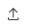
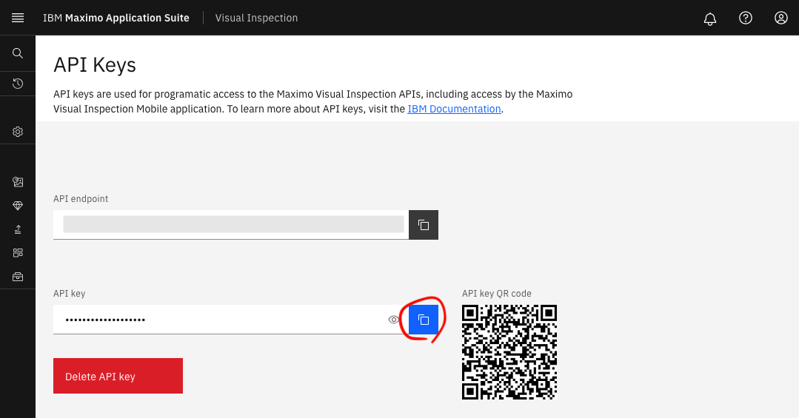

# Maximo Visual Inspection (MVI) Validator


[MVI Validator](https://github.com/IBM/mvi-validator) is an accuracy validator for Maximo Visual Inspection.


## Setup

1. Install Python
    Confirm that you can execute `python3` and `pip3` commands in terminal window.

    ```sh
    $ python3 --version
    Python 3.11.0
    
    $ pip3 --version 
    pip 22.3 from pip (python 3.11)
    ```
    
    
    
1. Install
   
    ```sh
    pip install 'git+https://github.com/IBM/mvi-validator.git'
    ```
    
    
    
2. Confirm that you can execute `mvi-validator` command in terminal window.
    ```sh
    $ mvi-validator --version
    0.0.13
    
    # If you see "Command not found", use `python -m mvi-validator` instead of `mvi-validator`
    $ python -m mvi-validator --version
    0.0.13
    ```


## Usage

1. MVI > left menu > dataset > select the test dataset you created > Click the right top export button  > Save the zip file on your PC
    

    

2. Expand the zip file
    - Example) if you expand in the directory `test_ball_bearing`, The dirctory structure looks like below.
        ```
        $ tree . | head
        .
        └── test_ball_bearing
            ├── 00196b51-d6e7-4372-81a6-f99f15541520.jpg
            ├── 00196b51-d6e7-4372-81a6-f99f15541520.xml
            ├── 002dc8fb-1806-4f73-9df8-4e93210e08f7.jpg
            ├── 002dc8fb-1806-4f73-9df8-4e93210e08f7.xml
            ├── 004b9976-3b36-4002-861b-d692c7db43dd.jpg
            ├── 004b9976-3b36-4002-861b-d692c7db43dd.xml
            ├── 005d5394-64ea-4d1f-a353-fac0fb5ebcb4.jpg
            ├── 005d5394-64ea-4d1f-a353-fac0fb5ebcb4.xml
        
        ```

    

3. MVI  > left menu > Model >  select the model you want to verify > deploy

    

4. MVI > left menu > `MVI Services` > `API Keys`, Copy
    

    

5. Set the api key to the environmental variable `APIKEY`

    ```sh
    export APIKEY=<API Key>
    ```

    

6. MVI > left menu > deployed model > click `copy` button in API endpoint section

    - Example) The URL copied from this button may be  `https://mvi.com/api/dlapis/bb44e214-e208-4e6a-a88b-d9ab173023da` 
        

    

7. Set the endpoint url to the environmental variable `ENDPOINT`

    ```sh
    export ENDPOINT=<URL>
    ```

    

8. Open your terminal > execute  `mvi-validator deployed-model detection --api [API endpoint URL]  [The directory of test dataset]`


    1. Example)  If APIURL is  `https://mvi.com/api/dlapis/bb44e214-e208-4e6a-a88b-d9ab173023da` , directory is  `test_ball_bearing` then
        ```sh
        $ mvi-validator deployed-model detection --apikey ${APIKEY} --api ${ENDPOINT} test_ball_bearing
        ```
        
    
    2. The result will be shown in markdown table
        ```markdown
        # Summary
        |   num_images |   num_gt_bbox |   num_pd_bbox |   total_tp |   total_fp |   total_fn |   precision |   recall |   f-measure |      mAP | model_id                             |
        |-------------:|--------------:|--------------:|-----------:|-----------:|-----------:|------------:|---------:|------------:|---------:|:-------------------------------------|
        |           28 |            27 |             9 |          8 |          1 |         19 |           1 | 0.185185 |    0.444444 | 0.888889 | bb44e214-e208-4e6a-a88b-d9ab173023da |
        ```


​        
​        
    3. If you use `--format csv` option with `mvi-validator` command, it generates CSV instead of markdown table.
           


## Usage (Parallel execution)

- By using `--parallel <NUM>` , inferences are done in parallel with`NUM` threads

```sh
$ mvi-validator deployed-model detection --apikey ${APIKEY} --api ${ENDPOINT} --parallel 8 test_ball_bearing
```


## Usage (Performance evaluation)

- By using ` --ignore-cache`, local caching is disabled.

- Also, performance data is shown in result.

```sh
$ mvi-validator deployed-model detection --apikey ${APIKEY} --api ${ENDPOINT}  --ignore-cache test_ball_bearing
```


**About performance indicators **

| Performance indicato                       | Description                                                |
| :----------------------------------------- | :--------------------------------------------------------- |
| Number of images                           | Number of inferences (number of image files)               |
| Total inference time                       | Time seconds during whole processing.                      |
| Througput                                  | Throughput (average inference numbers per 1 second)        |
| Average Completion Interval (1/Throughput) | Average time duraiton per one inference (= 1 / throughput) |
| Average inference time                     | Average inference time (seconds)                           |


## Usage (Inference with custom code)

When we want to use oss based inference, we can replace inference function by our custom code.

- By using `--inference_py <PYTHON FILE>` , the custom inference function in the Python code is used instead of default one.
- The custom Python file must include `InferenceClient` class that extends `mvi_validator.AbcInferenceClient`. See [sample code](samples/custom_inference.py).

```sh
$ mvi-validator deployed-model detection --inference_py my_custom.py test_ball_bearing
```


## Usage (Jupyter Notebook)


1. Install with notebook option
    ```sh
    $ pip3 install -e '.[notebook]'
    ```
2. Start jupyter notebook
    ```sh
    $ jupyter notebook
    ```


## Contributing

Open Issue [here](https://github.com/IBM/mvi-validator/issues) .


## Authors


Takahide Nogayama

<a href="https://github.com/nogayama"></a>


## License

MIT

​	
